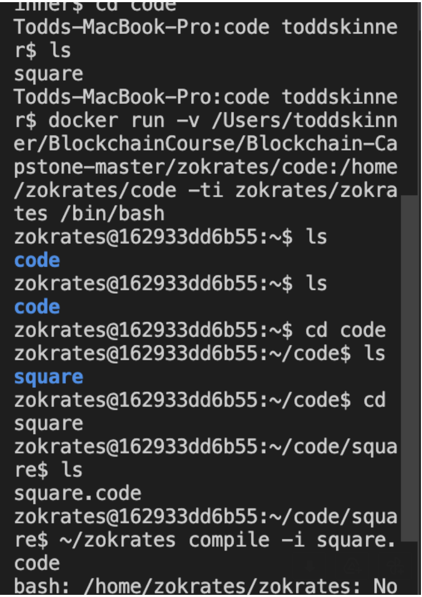
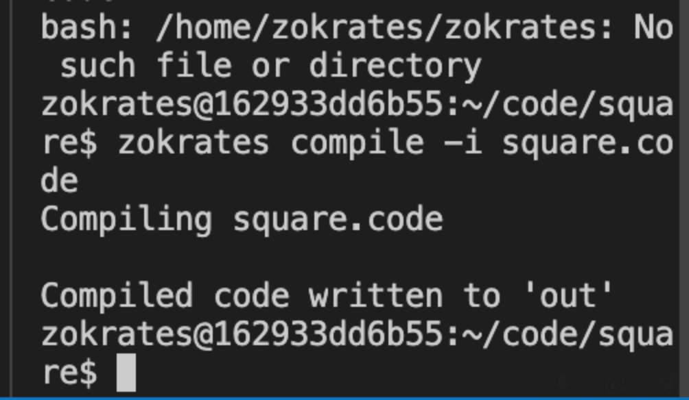
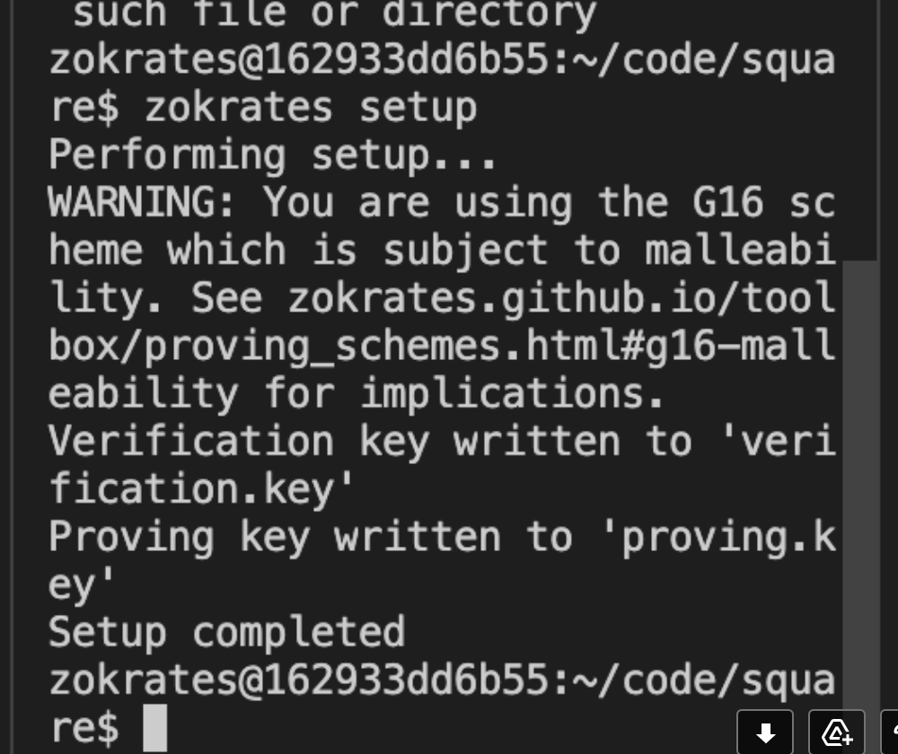
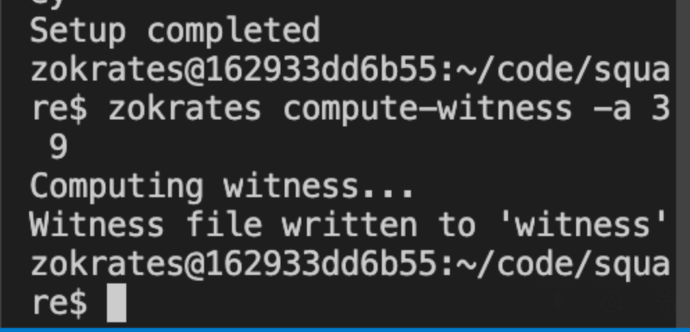

# Udacity Blockchain Capstone

The capstone will build upon the knowledge you have gained in the course in order to build a decentralized housing product. 

## SolnSquareVerifier Contract on the Rinkeby Network

<!-- **Contract address:**  0xe46beC7C4393B575CD130F171189980F1381a63E -->
**Contract address:**  0x0c0781F05874DC06B8a0B11c71F3494D68fA8850  
<!-- **Transaction ID:**    0x066e1ed034d91b6f55a7a6d25ef9900ce86a5f9b7572eef1a4ffe474d776ad7d   -->
**Transaction ID:**    0xf04623598dd3d50f426d76f8370e60116fd59ea7e61016f8090d808b490c562d  
<!-- **Etherscan:**   https://rinkeby.etherscan.io/address/0xe46beC7C4393B575CD130F171189980F1381a63E -->
**Etherscan:**   https://rinkeby.etherscan.io/address/0x0c0781F05874DC06B8a0B11c71F3494D68fA8850

## OpenSea marketplace

## NOTES: Running Zokrates

### docker run -v

### compile

### setup

### compute witness

### generate proof

# Project Resources

* [Remix - Solidity IDE](https://remix.ethereum.org/)
* [Visual Studio Code](https://code.visualstudio.com/)
* [Truffle Framework](https://truffleframework.com/)
* [Ganache - One Click Blockchain](https://truffleframework.com/ganache)
* [Open Zeppelin ](https://openzeppelin.org/)
* [Interactive zero knowledge 3-colorability demonstration](http://web.mit.edu/~ezyang/Public/graph/svg.html)
* [Docker](https://docs.docker.com/install/)
* [ZoKrates](https://github.com/Zokrates/ZoKrates)
