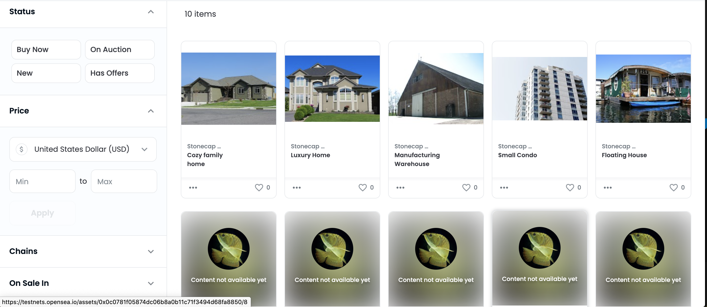

# Udacity Blockchain Capstone

The capstone will build upon the knowledge you have gained in the course in order to build a decentralized housing product. 

## Testing

Install all required npm packages

```
npm install
```

Cd into the contracts folder:

```cd eth-contracts```

Launch Ganache:

```
ganache-cli 
```

In a separate terminal window, run compile

```
truffle compile
```

Migrate smart contracts to ganache-cli:

```
truffle migrate
```

Run the tests:

```
truffle test
```

All 11 tests should pass and your terminal should look something like this:


## SolnSquareVerifier Contract on the Rinkeby Network

**Contract address:**  0x0c0781F05874DC06B8a0B11c71F3494D68fA8850  
**Transaction ID:**    0xf04623598dd3d50f426d76f8370e60116fd59ea7e61016f8090d808b490c562d  
**Etherscan:**   https://rinkeby.etherscan.io/address/0x0c0781F05874DC06B8a0B11c71F3494D68fA8850

## Contract ABI

```
[
    {
      "inputs": [
        {
          "internalType": "address",
          "name": "owner",
          "type": "address"
        }
      ],
      "payable": false,
      "stateMutability": "nonpayable",
      "type": "constructor"
    },
    {
      "anonymous": false,
      "inputs": [
        {
          "indexed": true,
          "internalType": "address",
          "name": "owner",
          "type": "address"
        },
        {
          "indexed": true,
          "internalType": "address",
          "name": "approved",
          "type": "address"
        },
        {
          "indexed": true,
          "internalType": "uint256",
          "name": "tokenId",
          "type": "uint256"
        }
      ],
      "name": "Approval",
      "type": "event"
    },
    {
      "anonymous": false,
      "inputs": [
        {
          "indexed": true,
          "internalType": "address",
          "name": "owner",
          "type": "address"
        },
        {
          "indexed": true,
          "internalType": "address",
          "name": "operator",
          "type": "address"
        },
        {
          "indexed": false,
          "internalType": "bool",
          "name": "approved",
          "type": "bool"
        }
      ],
      "name": "ApprovalForAll",
      "type": "event"
    },
    {
      "anonymous": false,
      "inputs": [
        {
          "indexed": false,
          "internalType": "address",
          "name": "trigger_address",
          "type": "address"
        }
      ],
      "name": "Paused",
      "type": "event"
    },
    {
      "anonymous": false,
      "inputs": [
        {
          "indexed": false,
          "internalType": "uint256",
          "name": "index",
          "type": "uint256"
        },
        {
          "indexed": false,
          "internalType": "address",
          "name": "account",
          "type": "address"
        }
      ],
      "name": "SolutionAdded",
      "type": "event"
    },
    {
      "anonymous": false,
      "inputs": [
        {
          "indexed": true,
          "internalType": "address",
          "name": "from",
          "type": "address"
        },
        {
          "indexed": true,
          "internalType": "address",
          "name": "to",
          "type": "address"
        },
        {
          "indexed": true,
          "internalType": "uint256",
          "name": "tokenId",
          "type": "uint256"
        }
      ],
      "name": "Transfer",
      "type": "event"
    },
    {
      "anonymous": false,
      "inputs": [
        {
          "indexed": true,
          "internalType": "address",
          "name": "oldOwner",
          "type": "address"
        },
        {
          "indexed": true,
          "internalType": "address",
          "name": "newOwner",
          "type": "address"
        }
      ],
      "name": "TransferOwnership",
      "type": "event"
    },
    {
      "anonymous": false,
      "inputs": [
        {
          "indexed": false,
          "internalType": "address",
          "name": "trigger_address",
          "type": "address"
        }
      ],
      "name": "Unpaused",
      "type": "event"
    },
    {
      "constant": false,
      "inputs": [
        {
          "internalType": "bytes32",
          "name": "_myid",
          "type": "bytes32"
        },
        {
          "internalType": "string",
          "name": "_result",
          "type": "string"
        }
      ],
      "name": "__callback",
      "outputs": [],
      "payable": false,
      "stateMutability": "nonpayable",
      "type": "function"
    },
    {
      "constant": false,
      "inputs": [
        {
          "internalType": "bytes32",
          "name": "_myid",
          "type": "bytes32"
        },
        {
          "internalType": "string",
          "name": "_result",
          "type": "string"
        },
        {
          "internalType": "bytes",
          "name": "_proof",
          "type": "bytes"
        }
      ],
      "name": "__callback",
      "outputs": [],
      "payable": false,
      "stateMutability": "nonpayable",
      "type": "function"
    },
    {
      "constant": false,
      "inputs": [
        {
          "internalType": "address",
          "name": "to",
          "type": "address"
        },
        {
          "internalType": "uint256",
          "name": "tokenId",
          "type": "uint256"
        }
      ],
      "name": "approve",
      "outputs": [],
      "payable": false,
      "stateMutability": "nonpayable",
      "type": "function"
    },
    {
      "constant": true,
      "inputs": [
        {
          "internalType": "address",
          "name": "owner",
          "type": "address"
        }
      ],
      "name": "balanceOf",
      "outputs": [
        {
          "internalType": "uint256",
          "name": "",
          "type": "uint256"
        }
      ],
      "payable": false,
      "stateMutability": "view",
      "type": "function"
    },
    {
      "constant": true,
      "inputs": [
        {
          "internalType": "uint256",
          "name": "tokenId",
          "type": "uint256"
        }
      ],
      "name": "getApproved",
      "outputs": [
        {
          "internalType": "address",
          "name": "",
          "type": "address"
        }
      ],
      "payable": false,
      "stateMutability": "view",
      "type": "function"
    },
    {
      "constant": true,
      "inputs": [],
      "name": "getBaseTokenURI",
      "outputs": [
        {
          "internalType": "string",
          "name": "",
          "type": "string"
        }
      ],
      "payable": false,
      "stateMutability": "view",
      "type": "function"
    },
    {
      "constant": true,
      "inputs": [],
      "name": "getName",
      "outputs": [
        {
          "internalType": "string",
          "name": "",
          "type": "string"
        }
      ],
      "payable": false,
      "stateMutability": "view",
      "type": "function"
    },
    {
      "constant": true,
      "inputs": [],
      "name": "getOwner",
      "outputs": [
        {
          "internalType": "address",
          "name": "",
          "type": "address"
        }
      ],
      "payable": false,
      "stateMutability": "view",
      "type": "function"
    },
    {
      "constant": true,
      "inputs": [],
      "name": "getSymbol",
      "outputs": [
        {
          "internalType": "string",
          "name": "",
          "type": "string"
        }
      ],
      "payable": false,
      "stateMutability": "view",
      "type": "function"
    },
    {
      "constant": true,
      "inputs": [
        {
          "internalType": "address",
          "name": "owner",
          "type": "address"
        },
        {
          "internalType": "address",
          "name": "operator",
          "type": "address"
        }
      ],
      "name": "isApprovedForAll",
      "outputs": [
        {
          "internalType": "bool",
          "name": "",
          "type": "bool"
        }
      ],
      "payable": false,
      "stateMutability": "view",
      "type": "function"
    },
    {
      "constant": true,
      "inputs": [],
      "name": "isOwner",
      "outputs": [
        {
          "internalType": "bool",
          "name": "",
          "type": "bool"
        }
      ],
      "payable": false,
      "stateMutability": "view",
      "type": "function"
    },
    {
      "constant": false,
      "inputs": [
        {
          "internalType": "address",
          "name": "to",
          "type": "address"
        },
        {
          "internalType": "uint256",
          "name": "tokenId",
          "type": "uint256"
        },
        {
          "internalType": "string",
          "name": "tokenURI",
          "type": "string"
        }
      ],
      "name": "mint",
      "outputs": [
        {
          "internalType": "bool",
          "name": "",
          "type": "bool"
        }
      ],
      "payable": false,
      "stateMutability": "nonpayable",
      "type": "function"
    },
    {
      "constant": true,
      "inputs": [
        {
          "internalType": "uint256",
          "name": "tokenId",
          "type": "uint256"
        }
      ],
      "name": "ownerOf",
      "outputs": [
        {
          "internalType": "address",
          "name": "",
          "type": "address"
        }
      ],
      "payable": false,
      "stateMutability": "view",
      "type": "function"
    },
    {
      "constant": false,
      "inputs": [],
      "name": "pause",
      "outputs": [],
      "payable": false,
      "stateMutability": "nonpayable",
      "type": "function"
    },
    {
      "constant": false,
      "inputs": [
        {
          "internalType": "address",
          "name": "from",
          "type": "address"
        },
        {
          "internalType": "address",
          "name": "to",
          "type": "address"
        },
        {
          "internalType": "uint256",
          "name": "tokenId",
          "type": "uint256"
        }
      ],
      "name": "safeTransferFrom",
      "outputs": [],
      "payable": false,
      "stateMutability": "nonpayable",
      "type": "function"
    },
    {
      "constant": false,
      "inputs": [
        {
          "internalType": "address",
          "name": "from",
          "type": "address"
        },
        {
          "internalType": "address",
          "name": "to",
          "type": "address"
        },
        {
          "internalType": "uint256",
          "name": "tokenId",
          "type": "uint256"
        },
        {
          "internalType": "bytes",
          "name": "_data",
          "type": "bytes"
        }
      ],
      "name": "safeTransferFrom",
      "outputs": [],
      "payable": false,
      "stateMutability": "nonpayable",
      "type": "function"
    },
    {
      "constant": false,
      "inputs": [
        {
          "internalType": "address",
          "name": "to",
          "type": "address"
        },
        {
          "internalType": "bool",
          "name": "approved",
          "type": "bool"
        }
      ],
      "name": "setApprovalForAll",
      "outputs": [],
      "payable": false,
      "stateMutability": "nonpayable",
      "type": "function"
    },
    {
      "constant": true,
      "inputs": [
        {
          "internalType": "bytes4",
          "name": "interfaceId",
          "type": "bytes4"
        }
      ],
      "name": "supportsInterface",
      "outputs": [
        {
          "internalType": "bool",
          "name": "",
          "type": "bool"
        }
      ],
      "payable": false,
      "stateMutability": "view",
      "type": "function"
    },
    {
      "constant": true,
      "inputs": [
        {
          "internalType": "uint256",
          "name": "index",
          "type": "uint256"
        }
      ],
      "name": "tokenByIndex",
      "outputs": [
        {
          "internalType": "uint256",
          "name": "",
          "type": "uint256"
        }
      ],
      "payable": false,
      "stateMutability": "view",
      "type": "function"
    },
    {
      "constant": true,
      "inputs": [
        {
          "internalType": "address",
          "name": "owner",
          "type": "address"
        },
        {
          "internalType": "uint256",
          "name": "index",
          "type": "uint256"
        }
      ],
      "name": "tokenOfOwnerByIndex",
      "outputs": [
        {
          "internalType": "uint256",
          "name": "",
          "type": "uint256"
        }
      ],
      "payable": false,
      "stateMutability": "view",
      "type": "function"
    },
    {
      "constant": true,
      "inputs": [
        {
          "internalType": "uint256",
          "name": "tokenId",
          "type": "uint256"
        }
      ],
      "name": "tokenURI",
      "outputs": [
        {
          "internalType": "string",
          "name": "",
          "type": "string"
        }
      ],
      "payable": false,
      "stateMutability": "view",
      "type": "function"
    },
    {
      "constant": true,
      "inputs": [],
      "name": "totalSupply",
      "outputs": [
        {
          "internalType": "uint256",
          "name": "",
          "type": "uint256"
        }
      ],
      "payable": false,
      "stateMutability": "view",
      "type": "function"
    },
    {
      "constant": false,
      "inputs": [
        {
          "internalType": "address",
          "name": "from",
          "type": "address"
        },
        {
          "internalType": "address",
          "name": "to",
          "type": "address"
        },
        {
          "internalType": "uint256",
          "name": "tokenId",
          "type": "uint256"
        }
      ],
      "name": "transferFrom",
      "outputs": [],
      "payable": false,
      "stateMutability": "nonpayable",
      "type": "function"
    },
    {
      "constant": false,
      "inputs": [
        {
          "internalType": "address",
          "name": "newOwner",
          "type": "address"
        }
      ],
      "name": "transferOwnership",
      "outputs": [],
      "payable": false,
      "stateMutability": "nonpayable",
      "type": "function"
    },
    {
      "constant": false,
      "inputs": [],
      "name": "unpause",
      "outputs": [],
      "payable": false,
      "stateMutability": "nonpayable",
      "type": "function"
    },
    {
      "constant": false,
      "inputs": [
        {
          "internalType": "bytes32",
          "name": "key",
          "type": "bytes32"
        },
        {
          "internalType": "address",
          "name": "solution_account",
          "type": "address"
        },
        {
          "internalType": "uint256",
          "name": "solution_index",
          "type": "uint256"
        }
      ],
      "name": "addSolution",
      "outputs": [],
      "payable": false,
      "stateMutability": "nonpayable",
      "type": "function"
    },
    {
      "constant": false,
      "inputs": [],
      "name": "getNumSolutions",
      "outputs": [
        {
          "internalType": "uint256",
          "name": "",
          "type": "uint256"
        }
      ],
      "payable": false,
      "stateMutability": "nonpayable",
      "type": "function"
    },
    {
      "constant": false,
      "inputs": [
        {
          "internalType": "address",
          "name": "account",
          "type": "address"
        },
        {
          "internalType": "uint256",
          "name": "index",
          "type": "uint256"
        },
        {
          "components": [
            {
              "components": [
                {
                  "internalType": "uint256",
                  "name": "X",
                  "type": "uint256"
                },
                {
                  "internalType": "uint256",
                  "name": "Y",
                  "type": "uint256"
                }
              ],
              "internalType": "struct Pairing.G1Point",
              "name": "a",
              "type": "tuple"
            },
            {
              "components": [
                {
                  "internalType": "uint256[2]",
                  "name": "X",
                  "type": "uint256[2]"
                },
                {
                  "internalType": "uint256[2]",
                  "name": "Y",
                  "type": "uint256[2]"
                }
              ],
              "internalType": "struct Pairing.G2Point",
              "name": "b",
              "type": "tuple"
            },
            {
              "components": [
                {
                  "internalType": "uint256",
                  "name": "X",
                  "type": "uint256"
                },
                {
                  "internalType": "uint256",
                  "name": "Y",
                  "type": "uint256"
                }
              ],
              "internalType": "struct Pairing.G1Point",
              "name": "c",
              "type": "tuple"
            }
          ],
          "internalType": "struct SquareVerifier.Proof",
          "name": "proof",
          "type": "tuple"
        },
        {
          "internalType": "uint256[2]",
          "name": "input",
          "type": "uint256[2]"
        }
      ],
      "name": "mintToken",
      "outputs": [
        {
          "internalType": "bool",
          "name": "",
          "type": "bool"
        }
      ],
      "payable": false,
      "stateMutability": "nonpayable",
      "type": "function"
    },
    {
      "constant": false,
      "inputs": [
        {
          "internalType": "address",
          "name": "account",
          "type": "address"
        },
        {
          "internalType": "uint256",
          "name": "index",
          "type": "uint256"
        },
        {
          "components": [
            {
              "components": [
                {
                  "internalType": "uint256",
                  "name": "X",
                  "type": "uint256"
                },
                {
                  "internalType": "uint256",
                  "name": "Y",
                  "type": "uint256"
                }
              ],
              "internalType": "struct Pairing.G1Point",
              "name": "a",
              "type": "tuple"
            },
            {
              "components": [
                {
                  "internalType": "uint256[2]",
                  "name": "X",
                  "type": "uint256[2]"
                },
                {
                  "internalType": "uint256[2]",
                  "name": "Y",
                  "type": "uint256[2]"
                }
              ],
              "internalType": "struct Pairing.G2Point",
              "name": "b",
              "type": "tuple"
            },
            {
              "components": [
                {
                  "internalType": "uint256",
                  "name": "X",
                  "type": "uint256"
                },
                {
                  "internalType": "uint256",
                  "name": "Y",
                  "type": "uint256"
                }
              ],
              "internalType": "struct Pairing.G1Point",
              "name": "c",
              "type": "tuple"
            }
          ],
          "internalType": "struct SquareVerifier.Proof",
          "name": "proof",
          "type": "tuple"
        },
        {
          "internalType": "uint256[2]",
          "name": "input",
          "type": "uint256[2]"
        }
      ],
      "name": "getKey",
      "outputs": [
        {
          "internalType": "bytes32",
          "name": "",
          "type": "bytes32"
        }
      ],
      "payable": false,
      "stateMutability": "nonpayable",
      "type": "function"
    }
  ]
```

## OpenSea marketplace

**Website:**   https://testnets.opensea.io/collection/stonecap




## Zokrates Steps

* **Run Zokrates docker container:**
  ```
  //docker run -v <path to your project folder>:/home/zokrates/code -ti zokrates/zokrates /bin/bash

  docker run -v/ Users/toddskinner/BlockchainCourse/Blockchain-Capstone-master/zokrates/code:/home/zokrates/code -ti zokrates/zokrates /bin/bash
  ```

  Change into the square directory
  ``` 
  cd code/square/
  ``` 

* **Compile**
  ``` 
  zokrates compile -i square.code
  ``` 

* **Setup**
  ``` 
  zokrates setup
  ```

* **Compute witness**
  ``` 
  zokrates compute-witness -a 3 9
  ```

* **Generate proof**
  ```
  zokrates generate-proof
  ```

* **Export verifier**
  ```  
  zokrates export-verifier
  ```

# Project Resources

* [Remix - Solidity IDE](https://remix.ethereum.org/)
* [Visual Studio Code](https://code.visualstudio.com/)
* [Truffle Framework](https://truffleframework.com/)
* [Ganache - One Click Blockchain](https://truffleframework.com/ganache)
* [Open Zeppelin ](https://openzeppelin.org/)
* [Interactive zero knowledge 3-colorability demonstration](http://web.mit.edu/~ezyang/Public/graph/svg.html)
* [Docker](https://docs.docker.com/install/)
* [ZoKrates](https://github.com/Zokrates/ZoKrates)
